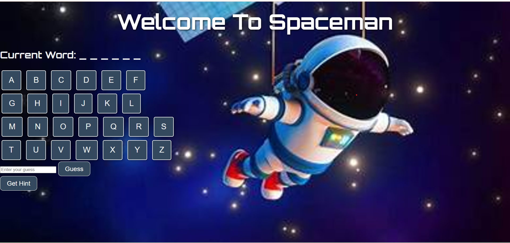

###### Spaceman Game
Welcome to Spaceman, a word-guessing game set in the vast expanse of space! Test your vocabulary skills by guessing space-themed words before running out of attempts. Can you figure out the secret word before your chances are up?

**Game Overview**
Spaceman is a single-player game where the player guesses a randomly selected space-themed word letter by letter or attempts to guess the entire word. The game ends when:

The player successfully guesses the word (Win).
The player makes six incorrect guesses (Loss).

**How to Play**
 **Start the Game: Load the game in your web browser.

**Guess Letters:**

Click on individual letter buttons to guess.
Correct guesses reveal the letter in the word.
Incorrect guesses are displayed in the “Wrong Guesses” section.
Full Word Guess (Optional):

Enter a word in the input field and click "Guess."
A correct guess wins the game instantly.
An incorrect word counts as one wrong guess.
Hints:

Click the "Get Hint" button for a clue (only available once per game).
Win/Loss Condition:

Win: Guess the word correctly.
Loss: Reach six incorrect guesses.
Restart: Click "Restart Game" or "Play Again" after winning or losing to start a new round.

**Features**
**Core Game Mechanics:**
Letter-by-letter guessing.
Full-word guess functionality.
Hint system for additional help (once per game).

**Game Interface:**
A professional, space-themed UI.
Responsive and visually appealing design.
Dynamic messages indicating game progress and outcomes.

**Technologies Used**
HTML: Structure of the web page.
CSS: Styling and responsive design.
JavaScript  Core game logic.

**How to Contribute**
I welcome contributions! If you would like to improve the game or add new features, feel free to fork this repository, make changes, and submit a pull request.

**Contribution Guidelines:**
Fork the repository.
Create a new branch for your feature or bug fix.
Commit your changes with a clear and concise message.
Push your changes to your forked repository.
Submit a pull request with a description of what you have changed.

**License**
This project is open source and available.

